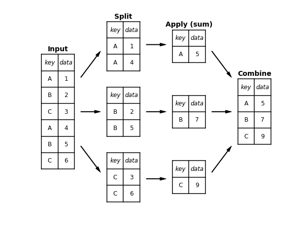

```python
print('Note')

import numpy as np

"""

Pandas tips and tricks


"""
print('')
```

    Note
    


```python
import pandas as pd
import numpy as np
import IPython
import sys

print(sys.version, '\n')
print('{}: {}'.format('pandas', pd.__version__))
print('{}: {}'.format('numpy', np.__version__))
print('{}: {}'.format('IPython', IPython.__version__))
```

    3.6.5 (v3.6.5:f59c0932b4, Mar 28 2018, 03:03:55) 
    [GCC 4.2.1 (Apple Inc. build 5666) (dot 3)] 
    
    pandas: 0.23.1
    numpy: 1.14.5
    IPython: 6.4.0


```python
class display_df(object):
    template = """<div style="float: left; padding: 10px;">
    <p style='font-family:"Courier New", Courier, monospace'>{0}</p>{1}
    </div>"""
    def __init__(self, *args):
        self.args = args
        
    def _repr_html_(self):
        return '\n'.join(self.template.format(a, eval(a)._repr_html_()) for a in self.args)
    
    def __repr__(self):
        return '\n\n'.join(a + '\n' + repr(eval(a)) for a in self.args)
    
def display_command(command):
    print('> {}:\n {}\n'.format(command, eval(command)))
```


```python
def make_toy_df(cols, ind):
    data = {c: [str(c) + str(i) for i in ind] for c in cols}
    return pd.DataFrame(data, ind)

# example DataFrame
make_toy_df('ABC', range(3))
```


<div>
<style scoped>
    .dataframe tbody tr th:only-of-type {
        vertical-align: middle;
    }

    .dataframe tbody tr th {
        vertical-align: top;
    }

    .dataframe thead th {
        text-align: right;
    }
</style>
<table border="1" class="dataframe">
  <thead>
    <tr style="text-align: right;">
      <th></th>
      <th>A</th>
      <th>B</th>
      <th>C</th>
    </tr>
  </thead>
  <tbody>
    <tr>
      <th>0</th>
      <td>A0</td>
      <td>B0</td>
      <td>C0</td>
    </tr>
    <tr>
      <th>1</th>
      <td>A1</td>
      <td>B1</td>
      <td>C1</td>
    </tr>
    <tr>
      <th>2</th>
      <td>A2</td>
      <td>B2</td>
      <td>C2</td>
    </tr>
  </tbody>
</table>
</div>


## DataFrame and Series

DataFrame and Series are the major structures in Pandas

DataFrame is like a table, and Series is each column

or we can say DataFrame is a dictionary of Series


```python
df = make_toy_df('ABC', range(5))
print('type of {}: {}'.format('df', type(df)))
df
```

    type of df: <class 'pandas.core.frame.DataFrame'>


<div>
<style scoped>
    .dataframe tbody tr th:only-of-type {
        vertical-align: middle;
    }

    .dataframe tbody tr th {
        vertical-align: top;
    }

    .dataframe thead th {
        text-align: right;
    }
</style>
<table border="1" class="dataframe">
  <thead>
    <tr style="text-align: right;">
      <th></th>
      <th>A</th>
      <th>B</th>
      <th>C</th>
    </tr>
  </thead>
  <tbody>
    <tr>
      <th>0</th>
      <td>A0</td>
      <td>B0</td>
      <td>C0</td>
    </tr>
    <tr>
      <th>1</th>
      <td>A1</td>
      <td>B1</td>
      <td>C1</td>
    </tr>
    <tr>
      <th>2</th>
      <td>A2</td>
      <td>B2</td>
      <td>C2</td>
    </tr>
    <tr>
      <th>3</th>
      <td>A3</td>
      <td>B3</td>
      <td>C3</td>
    </tr>
    <tr>
      <th>4</th>
      <td>A4</td>
      <td>B4</td>
      <td>C4</td>
    </tr>
  </tbody>
</table>
</div>


```python
print('type of {}: {}'.format("df['A']", type(df['A'])))
df['A']
```

    type of df['A']: <class 'pandas.core.series.Series'>


    0    A0
    1    A1
    2    A2
    3    A3
    4    A4
    Name: A, dtype: object


```python
## dictionary-style & attribute-style to access a column
print(df['A'])
print(df.A)
print(df['A'] is df.A)
```

    0    A0
    1    A1
    2    A2
    3    A3
    4    A4
    Name: A, dtype: object
    0    A0
    1    A1
    2    A2
    3    A3
    4    A4
    Name: A, dtype: object
    True


```python
## add a new column
df['shape'] = list(range(df.shape[0]))

display_command("df['A'] is df.A")
display_command("df['shape'] is df.shape")  # if already have this method
df
```

    > df['A'] is df.A:
     True
    
    > df['shape'] is df.shape:
     False
    


<div>
<style scoped>
    .dataframe tbody tr th:only-of-type {
        vertical-align: middle;
    }

    .dataframe tbody tr th {
        vertical-align: top;
    }

    .dataframe thead th {
        text-align: right;
    }
</style>
<table border="1" class="dataframe">
  <thead>
    <tr style="text-align: right;">
      <th></th>
      <th>A</th>
      <th>B</th>
      <th>C</th>
      <th>shape</th>
    </tr>
  </thead>
  <tbody>
    <tr>
      <th>0</th>
      <td>A0</td>
      <td>B0</td>
      <td>C0</td>
      <td>0</td>
    </tr>
    <tr>
      <th>1</th>
      <td>A1</td>
      <td>B1</td>
      <td>C1</td>
      <td>1</td>
    </tr>
    <tr>
      <th>2</th>
      <td>A2</td>
      <td>B2</td>
      <td>C2</td>
      <td>2</td>
    </tr>
    <tr>
      <th>3</th>
      <td>A3</td>
      <td>B3</td>
      <td>C3</td>
      <td>3</td>
    </tr>
    <tr>
      <th>4</th>
      <td>A4</td>
      <td>B4</td>
      <td>C4</td>
      <td>4</td>
    </tr>
  </tbody>
</table>
</div>


```python
## drop column
df = df.drop(labels='shape', axis=1)
df
```


<div>
<style scoped>
    .dataframe tbody tr th:only-of-type {
        vertical-align: middle;
    }

    .dataframe tbody tr th {
        vertical-align: top;
    }

    .dataframe thead th {
        text-align: right;
    }
</style>
<table border="1" class="dataframe">
  <thead>
    <tr style="text-align: right;">
      <th></th>
      <th>A</th>
      <th>B</th>
      <th>C</th>
    </tr>
  </thead>
  <tbody>
    <tr>
      <th>0</th>
      <td>A0</td>
      <td>B0</td>
      <td>C0</td>
    </tr>
    <tr>
      <th>1</th>
      <td>A1</td>
      <td>B1</td>
      <td>C1</td>
    </tr>
    <tr>
      <th>2</th>
      <td>A2</td>
      <td>B2</td>
      <td>C2</td>
    </tr>
    <tr>
      <th>3</th>
      <td>A3</td>
      <td>B3</td>
      <td>C3</td>
    </tr>
    <tr>
      <th>4</th>
      <td>A4</td>
      <td>B4</td>
      <td>C4</td>
    </tr>
  </tbody>
</table>
</div>


## Index and Select


```python
## we can use column_name_list to select multi columns
display_df('df', "df[['A']]", "df[['A', 'C']]")
```


<div style="float: left; padding: 10px;">
    <p style='font-family:"Courier New", Courier, monospace'>df</p><div>
<style scoped>
    .dataframe tbody tr th:only-of-type {
        vertical-align: middle;
    }

    .dataframe tbody tr th {
        vertical-align: top;
    }

    .dataframe thead th {
        text-align: right;
    }
</style>
<table border="1" class="dataframe">
  <thead>
    <tr style="text-align: right;">
      <th></th>
      <th>A</th>
      <th>B</th>
      <th>C</th>
    </tr>
  </thead>
  <tbody>
    <tr>
      <th>0</th>
      <td>A0</td>
      <td>B0</td>
      <td>C0</td>
    </tr>
    <tr>
      <th>1</th>
      <td>A1</td>
      <td>B1</td>
      <td>C1</td>
    </tr>
    <tr>
      <th>2</th>
      <td>A2</td>
      <td>B2</td>
      <td>C2</td>
    </tr>
    <tr>
      <th>3</th>
      <td>A3</td>
      <td>B3</td>
      <td>C3</td>
    </tr>
    <tr>
      <th>4</th>
      <td>A4</td>
      <td>B4</td>
      <td>C4</td>
    </tr>
  </tbody>
</table>
</div>
    </div>
<div style="float: left; padding: 10px;">
    <p style='font-family:"Courier New", Courier, monospace'>df[['A']]</p><div>
<style scoped>
    .dataframe tbody tr th:only-of-type {
        vertical-align: middle;
    }

    .dataframe tbody tr th {
        vertical-align: top;
    }

    .dataframe thead th {
        text-align: right;
    }
</style>
<table border="1" class="dataframe">
  <thead>
    <tr style="text-align: right;">
      <th></th>
      <th>A</th>
    </tr>
  </thead>
  <tbody>
    <tr>
      <th>0</th>
      <td>A0</td>
    </tr>
    <tr>
      <th>1</th>
      <td>A1</td>
    </tr>
    <tr>
      <th>2</th>
      <td>A2</td>
    </tr>
    <tr>
      <th>3</th>
      <td>A3</td>
    </tr>
    <tr>
      <th>4</th>
      <td>A4</td>
    </tr>
  </tbody>
</table>
</div>
    </div>
<div style="float: left; padding: 10px;">
    <p style='font-family:"Courier New", Courier, monospace'>df[['A', 'C']]</p><div>
<style scoped>
    .dataframe tbody tr th:only-of-type {
        vertical-align: middle;
    }

    .dataframe tbody tr th {
        vertical-align: top;
    }

    .dataframe thead th {
        text-align: right;
    }
</style>
<table border="1" class="dataframe">
  <thead>
    <tr style="text-align: right;">
      <th></th>
      <th>A</th>
      <th>C</th>
    </tr>
  </thead>
  <tbody>
    <tr>
      <th>0</th>
      <td>A0</td>
      <td>C0</td>
    </tr>
    <tr>
      <th>1</th>
      <td>A1</td>
      <td>C1</td>
    </tr>
    <tr>
      <th>2</th>
      <td>A2</td>
      <td>C2</td>
    </tr>
    <tr>
      <th>3</th>
      <td>A3</td>
      <td>C3</td>
    </tr>
    <tr>
      <th>4</th>
      <td>A4</td>
      <td>C4</td>
    </tr>
  </tbody>
</table>
</div>
    </div>


### Array-style indexing
[ ]: select row  
iloc: select [row, col] by python-index (start from 0)  
loc: select [row, col] by name  


```python
## iloc & loc
display_df('df[2:4]', 'df.iloc[2:4, 1:3]', "df.loc[2:4, 'A':'C']")
```


<div style="float: left; padding: 10px;">
    <p style='font-family:"Courier New", Courier, monospace'>df[2:4]</p><div>
<style scoped>
    .dataframe tbody tr th:only-of-type {
        vertical-align: middle;
    }

    .dataframe tbody tr th {
        vertical-align: top;
    }

    .dataframe thead th {
        text-align: right;
    }
</style>
<table border="1" class="dataframe">
  <thead>
    <tr style="text-align: right;">
      <th></th>
      <th>A</th>
      <th>B</th>
      <th>C</th>
    </tr>
  </thead>
  <tbody>
    <tr>
      <th>2</th>
      <td>A2</td>
      <td>B2</td>
      <td>C2</td>
    </tr>
    <tr>
      <th>3</th>
      <td>A3</td>
      <td>B3</td>
      <td>C3</td>
    </tr>
  </tbody>
</table>
</div>
    </div>
<div style="float: left; padding: 10px;">
    <p style='font-family:"Courier New", Courier, monospace'>df.iloc[2:4, 1:3]</p><div>
<style scoped>
    .dataframe tbody tr th:only-of-type {
        vertical-align: middle;
    }

    .dataframe tbody tr th {
        vertical-align: top;
    }

    .dataframe thead th {
        text-align: right;
    }
</style>
<table border="1" class="dataframe">
  <thead>
    <tr style="text-align: right;">
      <th></th>
      <th>B</th>
      <th>C</th>
    </tr>
  </thead>
  <tbody>
    <tr>
      <th>2</th>
      <td>B2</td>
      <td>C2</td>
    </tr>
    <tr>
      <th>3</th>
      <td>B3</td>
      <td>C3</td>
    </tr>
  </tbody>
</table>
</div>
    </div>
<div style="float: left; padding: 10px;">
    <p style='font-family:"Courier New", Courier, monospace'>df.loc[2:4, 'A':'C']</p><div>
<style scoped>
    .dataframe tbody tr th:only-of-type {
        vertical-align: middle;
    }

    .dataframe tbody tr th {
        vertical-align: top;
    }

    .dataframe thead th {
        text-align: right;
    }
</style>
<table border="1" class="dataframe">
  <thead>
    <tr style="text-align: right;">
      <th></th>
      <th>A</th>
      <th>B</th>
      <th>C</th>
    </tr>
  </thead>
  <tbody>
    <tr>
      <th>2</th>
      <td>A2</td>
      <td>B2</td>
      <td>C2</td>
    </tr>
    <tr>
      <th>3</th>
      <td>A3</td>
      <td>B3</td>
      <td>C3</td>
    </tr>
    <tr>
      <th>4</th>
      <td>A4</td>
      <td>B4</td>
      <td>C4</td>
    </tr>
  </tbody>
</table>
</div>
    </div>


#### select by condition (index Boolean mask)


```python
df['Q1'] = np.random.randint(10, size=len(df))
df['Q2'] = np.random.randint(10, size=len(df))
display_df('df', "df[df['Q1']>5]", "df[(df['Q1']>5) & (df['Q2']<5)]")
```


<div style="float: left; padding: 10px;">
    <p style='font-family:"Courier New", Courier, monospace'>df</p><div>
<style scoped>
    .dataframe tbody tr th:only-of-type {
        vertical-align: middle;
    }

    .dataframe tbody tr th {
        vertical-align: top;
    }

    .dataframe thead th {
        text-align: right;
    }
</style>
<table border="1" class="dataframe">
  <thead>
    <tr style="text-align: right;">
      <th></th>
      <th>A</th>
      <th>B</th>
      <th>C</th>
      <th>Q1</th>
      <th>Q2</th>
    </tr>
  </thead>
  <tbody>
    <tr>
      <th>0</th>
      <td>A0</td>
      <td>B0</td>
      <td>C0</td>
      <td>1</td>
      <td>6</td>
    </tr>
    <tr>
      <th>1</th>
      <td>A1</td>
      <td>B1</td>
      <td>C1</td>
      <td>0</td>
      <td>0</td>
    </tr>
    <tr>
      <th>2</th>
      <td>A2</td>
      <td>B2</td>
      <td>C2</td>
      <td>8</td>
      <td>8</td>
    </tr>
    <tr>
      <th>3</th>
      <td>A3</td>
      <td>B3</td>
      <td>C3</td>
      <td>1</td>
      <td>6</td>
    </tr>
    <tr>
      <th>4</th>
      <td>A4</td>
      <td>B4</td>
      <td>C4</td>
      <td>2</td>
      <td>4</td>
    </tr>
  </tbody>
</table>
</div>
    </div>
<div style="float: left; padding: 10px;">
    <p style='font-family:"Courier New", Courier, monospace'>df[df['Q1']>5]</p><div>
<style scoped>
    .dataframe tbody tr th:only-of-type {
        vertical-align: middle;
    }

    .dataframe tbody tr th {
        vertical-align: top;
    }

    .dataframe thead th {
        text-align: right;
    }
</style>
<table border="1" class="dataframe">
  <thead>
    <tr style="text-align: right;">
      <th></th>
      <th>A</th>
      <th>B</th>
      <th>C</th>
      <th>Q1</th>
      <th>Q2</th>
    </tr>
  </thead>
  <tbody>
    <tr>
      <th>2</th>
      <td>A2</td>
      <td>B2</td>
      <td>C2</td>
      <td>8</td>
      <td>8</td>
    </tr>
  </tbody>
</table>
</div>
    </div>
<div style="float: left; padding: 10px;">
    <p style='font-family:"Courier New", Courier, monospace'>df[(df['Q1']>5) & (df['Q2']<5)]</p><div>
<style scoped>
    .dataframe tbody tr th:only-of-type {
        vertical-align: middle;
    }

    .dataframe tbody tr th {
        vertical-align: top;
    }

    .dataframe thead th {
        text-align: right;
    }
</style>
<table border="1" class="dataframe">
  <thead>
    <tr style="text-align: right;">
      <th></th>
      <th>A</th>
      <th>B</th>
      <th>C</th>
      <th>Q1</th>
      <th>Q2</th>
    </tr>
  </thead>
  <tbody>
  </tbody>
</table>
</div>
    </div>


#### multiple conditions: intersection (&), union (|), symmetric difference (^)


```python
display_df("df[(df['Q1']>5) & (df['Q2']<5)]", "df[(df['Q1']>5) | (df['Q2']<5)]", "df[(df['Q1']>5) ^ (df['Q2']<5)]")
```


<div style="float: left; padding: 10px;">
    <p style='font-family:"Courier New", Courier, monospace'>df[(df['Q1']>5) & (df['Q2']<5)]</p><div>
<style scoped>
    .dataframe tbody tr th:only-of-type {
        vertical-align: middle;
    }

    .dataframe tbody tr th {
        vertical-align: top;
    }

    .dataframe thead th {
        text-align: right;
    }
</style>
<table border="1" class="dataframe">
  <thead>
    <tr style="text-align: right;">
      <th></th>
      <th>A</th>
      <th>B</th>
      <th>C</th>
      <th>Q1</th>
      <th>Q2</th>
    </tr>
  </thead>
  <tbody>
  </tbody>
</table>
</div>
    </div>
<div style="float: left; padding: 10px;">
    <p style='font-family:"Courier New", Courier, monospace'>df[(df['Q1']>5) | (df['Q2']<5)]</p><div>
<style scoped>
    .dataframe tbody tr th:only-of-type {
        vertical-align: middle;
    }

    .dataframe tbody tr th {
        vertical-align: top;
    }

    .dataframe thead th {
        text-align: right;
    }
</style>
<table border="1" class="dataframe">
  <thead>
    <tr style="text-align: right;">
      <th></th>
      <th>A</th>
      <th>B</th>
      <th>C</th>
      <th>Q1</th>
      <th>Q2</th>
    </tr>
  </thead>
  <tbody>
    <tr>
      <th>1</th>
      <td>A1</td>
      <td>B1</td>
      <td>C1</td>
      <td>0</td>
      <td>0</td>
    </tr>
    <tr>
      <th>2</th>
      <td>A2</td>
      <td>B2</td>
      <td>C2</td>
      <td>8</td>
      <td>8</td>
    </tr>
    <tr>
      <th>4</th>
      <td>A4</td>
      <td>B4</td>
      <td>C4</td>
      <td>2</td>
      <td>4</td>
    </tr>
  </tbody>
</table>
</div>
    </div>
<div style="float: left; padding: 10px;">
    <p style='font-family:"Courier New", Courier, monospace'>df[(df['Q1']>5) ^ (df['Q2']<5)]</p><div>
<style scoped>
    .dataframe tbody tr th:only-of-type {
        vertical-align: middle;
    }

    .dataframe tbody tr th {
        vertical-align: top;
    }

    .dataframe thead th {
        text-align: right;
    }
</style>
<table border="1" class="dataframe">
  <thead>
    <tr style="text-align: right;">
      <th></th>
      <th>A</th>
      <th>B</th>
      <th>C</th>
      <th>Q1</th>
      <th>Q2</th>
    </tr>
  </thead>
  <tbody>
    <tr>
      <th>1</th>
      <td>A1</td>
      <td>B1</td>
      <td>C1</td>
      <td>0</td>
      <td>0</td>
    </tr>
    <tr>
      <th>2</th>
      <td>A2</td>
      <td>B2</td>
      <td>C2</td>
      <td>8</td>
      <td>8</td>
    </tr>
    <tr>
      <th>4</th>
      <td>A4</td>
      <td>B4</td>
      <td>C4</td>
      <td>2</td>
      <td>4</td>
    </tr>
  </tbody>
</table>
</div>
    </div>


#### check in list (`isin()`)


```python
df['name'] = ['Kai', 'Jim', 'Toby', 'Frank', 'YiHsin']
boy_list = ['Kai', 'Jim', 'Toby', 'Frank']
display_df("df", "df[df['name'].isin(boy_list)]", "df[~df['name'].isin(boy_list)]")
```


<div style="float: left; padding: 10px;">
    <p style='font-family:"Courier New", Courier, monospace'>df</p><div>
<style scoped>
    .dataframe tbody tr th:only-of-type {
        vertical-align: middle;
    }

    .dataframe tbody tr th {
        vertical-align: top;
    }

    .dataframe thead th {
        text-align: right;
    }
</style>
<table border="1" class="dataframe">
  <thead>
    <tr style="text-align: right;">
      <th></th>
      <th>A</th>
      <th>B</th>
      <th>C</th>
      <th>Q1</th>
      <th>Q2</th>
      <th>name</th>
    </tr>
  </thead>
  <tbody>
    <tr>
      <th>0</th>
      <td>A0</td>
      <td>B0</td>
      <td>C0</td>
      <td>1</td>
      <td>6</td>
      <td>Kai</td>
    </tr>
    <tr>
      <th>1</th>
      <td>A1</td>
      <td>B1</td>
      <td>C1</td>
      <td>0</td>
      <td>0</td>
      <td>Jim</td>
    </tr>
    <tr>
      <th>2</th>
      <td>A2</td>
      <td>B2</td>
      <td>C2</td>
      <td>8</td>
      <td>8</td>
      <td>Toby</td>
    </tr>
    <tr>
      <th>3</th>
      <td>A3</td>
      <td>B3</td>
      <td>C3</td>
      <td>1</td>
      <td>6</td>
      <td>Frank</td>
    </tr>
    <tr>
      <th>4</th>
      <td>A4</td>
      <td>B4</td>
      <td>C4</td>
      <td>2</td>
      <td>4</td>
      <td>YiHsin</td>
    </tr>
  </tbody>
</table>
</div>
    </div>
<div style="float: left; padding: 10px;">
    <p style='font-family:"Courier New", Courier, monospace'>df[df['name'].isin(boy_list)]</p><div>
<style scoped>
    .dataframe tbody tr th:only-of-type {
        vertical-align: middle;
    }

    .dataframe tbody tr th {
        vertical-align: top;
    }

    .dataframe thead th {
        text-align: right;
    }
</style>
<table border="1" class="dataframe">
  <thead>
    <tr style="text-align: right;">
      <th></th>
      <th>A</th>
      <th>B</th>
      <th>C</th>
      <th>Q1</th>
      <th>Q2</th>
      <th>name</th>
    </tr>
  </thead>
  <tbody>
    <tr>
      <th>0</th>
      <td>A0</td>
      <td>B0</td>
      <td>C0</td>
      <td>1</td>
      <td>6</td>
      <td>Kai</td>
    </tr>
    <tr>
      <th>1</th>
      <td>A1</td>
      <td>B1</td>
      <td>C1</td>
      <td>0</td>
      <td>0</td>
      <td>Jim</td>
    </tr>
    <tr>
      <th>2</th>
      <td>A2</td>
      <td>B2</td>
      <td>C2</td>
      <td>8</td>
      <td>8</td>
      <td>Toby</td>
    </tr>
    <tr>
      <th>3</th>
      <td>A3</td>
      <td>B3</td>
      <td>C3</td>
      <td>1</td>
      <td>6</td>
      <td>Frank</td>
    </tr>
  </tbody>
</table>
</div>
    </div>
<div style="float: left; padding: 10px;">
    <p style='font-family:"Courier New", Courier, monospace'>df[~df['name'].isin(boy_list)]</p><div>
<style scoped>
    .dataframe tbody tr th:only-of-type {
        vertical-align: middle;
    }

    .dataframe tbody tr th {
        vertical-align: top;
    }

    .dataframe thead th {
        text-align: right;
    }
</style>
<table border="1" class="dataframe">
  <thead>
    <tr style="text-align: right;">
      <th></th>
      <th>A</th>
      <th>B</th>
      <th>C</th>
      <th>Q1</th>
      <th>Q2</th>
      <th>name</th>
    </tr>
  </thead>
  <tbody>
    <tr>
      <th>4</th>
      <td>A4</td>
      <td>B4</td>
      <td>C4</td>
      <td>2</td>
      <td>4</td>
      <td>YiHsin</td>
    </tr>
  </tbody>
</table>
</div>
    </div>


#### check NaN (`isna()` or `isnull()`)


```python
df['NaN_test'] = [100, None, np.nan, '', np.nan]
display_df("df", "df[df['NaN_test'].isna()]", "df[~df['NaN_test'].isna()]")
```


<div style="float: left; padding: 10px;">
    <p style='font-family:"Courier New", Courier, monospace'>df</p><div>
<style scoped>
    .dataframe tbody tr th:only-of-type {
        vertical-align: middle;
    }

    .dataframe tbody tr th {
        vertical-align: top;
    }

    .dataframe thead th {
        text-align: right;
    }
</style>
<table border="1" class="dataframe">
  <thead>
    <tr style="text-align: right;">
      <th></th>
      <th>A</th>
      <th>B</th>
      <th>C</th>
      <th>Q1</th>
      <th>Q2</th>
      <th>name</th>
      <th>NaN_test</th>
    </tr>
  </thead>
  <tbody>
    <tr>
      <th>0</th>
      <td>A0</td>
      <td>B0</td>
      <td>C0</td>
      <td>1</td>
      <td>6</td>
      <td>Kai</td>
      <td>100</td>
    </tr>
    <tr>
      <th>1</th>
      <td>A1</td>
      <td>B1</td>
      <td>C1</td>
      <td>0</td>
      <td>0</td>
      <td>Jim</td>
      <td>None</td>
    </tr>
    <tr>
      <th>2</th>
      <td>A2</td>
      <td>B2</td>
      <td>C2</td>
      <td>8</td>
      <td>8</td>
      <td>Toby</td>
      <td>NaN</td>
    </tr>
    <tr>
      <th>3</th>
      <td>A3</td>
      <td>B3</td>
      <td>C3</td>
      <td>1</td>
      <td>6</td>
      <td>Frank</td>
      <td></td>
    </tr>
    <tr>
      <th>4</th>
      <td>A4</td>
      <td>B4</td>
      <td>C4</td>
      <td>2</td>
      <td>4</td>
      <td>YiHsin</td>
      <td>NaN</td>
    </tr>
  </tbody>
</table>
</div>
    </div>
<div style="float: left; padding: 10px;">
    <p style='font-family:"Courier New", Courier, monospace'>df[df['NaN_test'].isna()]</p><div>
<style scoped>
    .dataframe tbody tr th:only-of-type {
        vertical-align: middle;
    }

    .dataframe tbody tr th {
        vertical-align: top;
    }

    .dataframe thead th {
        text-align: right;
    }
</style>
<table border="1" class="dataframe">
  <thead>
    <tr style="text-align: right;">
      <th></th>
      <th>A</th>
      <th>B</th>
      <th>C</th>
      <th>Q1</th>
      <th>Q2</th>
      <th>name</th>
      <th>NaN_test</th>
    </tr>
  </thead>
  <tbody>
    <tr>
      <th>1</th>
      <td>A1</td>
      <td>B1</td>
      <td>C1</td>
      <td>0</td>
      <td>0</td>
      <td>Jim</td>
      <td>None</td>
    </tr>
    <tr>
      <th>2</th>
      <td>A2</td>
      <td>B2</td>
      <td>C2</td>
      <td>8</td>
      <td>8</td>
      <td>Toby</td>
      <td>NaN</td>
    </tr>
    <tr>
      <th>4</th>
      <td>A4</td>
      <td>B4</td>
      <td>C4</td>
      <td>2</td>
      <td>4</td>
      <td>YiHsin</td>
      <td>NaN</td>
    </tr>
  </tbody>
</table>
</div>
    </div>
<div style="float: left; padding: 10px;">
    <p style='font-family:"Courier New", Courier, monospace'>df[~df['NaN_test'].isna()]</p><div>
<style scoped>
    .dataframe tbody tr th:only-of-type {
        vertical-align: middle;
    }

    .dataframe tbody tr th {
        vertical-align: top;
    }

    .dataframe thead th {
        text-align: right;
    }
</style>
<table border="1" class="dataframe">
  <thead>
    <tr style="text-align: right;">
      <th></th>
      <th>A</th>
      <th>B</th>
      <th>C</th>
      <th>Q1</th>
      <th>Q2</th>
      <th>name</th>
      <th>NaN_test</th>
    </tr>
  </thead>
  <tbody>
    <tr>
      <th>0</th>
      <td>A0</td>
      <td>B0</td>
      <td>C0</td>
      <td>1</td>
      <td>6</td>
      <td>Kai</td>
      <td>100</td>
    </tr>
    <tr>
      <th>3</th>
      <td>A3</td>
      <td>B3</td>
      <td>C3</td>
      <td>1</td>
      <td>6</td>
      <td>Frank</td>
      <td></td>
    </tr>
  </tbody>
</table>
</div>
    </div>


#### (＊) avoid using '==' to check NaN


```python
display_command('None == None')
display_command('np.nan == np.nan')
display_command('np.nan == None')
```

    > None == None:
     True
    
    > np.nan == np.nan:
     False
    
    > np.nan == None:
     False
    


## Concat and Merge

#### concat (append)


```python
df1 = make_toy_df('AB', range(3))
df2 = make_toy_df('AB', range(2))
display_df('df1', 'df2', 'pd.concat([df1, df2])', 
           'pd.concat([df1, df2], ignore_index=True)', 'pd.concat([df1, df2], axis=1)')
```


<div style="float: left; padding: 10px;">
    <p style='font-family:"Courier New", Courier, monospace'>df1</p><div>
<style scoped>
    .dataframe tbody tr th:only-of-type {
        vertical-align: middle;
    }

    .dataframe tbody tr th {
        vertical-align: top;
    }

    .dataframe thead th {
        text-align: right;
    }
</style>
<table border="1" class="dataframe">
  <thead>
    <tr style="text-align: right;">
      <th></th>
      <th>A</th>
      <th>B</th>
    </tr>
  </thead>
  <tbody>
    <tr>
      <th>0</th>
      <td>A0</td>
      <td>B0</td>
    </tr>
    <tr>
      <th>1</th>
      <td>A1</td>
      <td>B1</td>
    </tr>
    <tr>
      <th>2</th>
      <td>A2</td>
      <td>B2</td>
    </tr>
  </tbody>
</table>
</div>
    </div>
<div style="float: left; padding: 10px;">
    <p style='font-family:"Courier New", Courier, monospace'>df2</p><div>
<style scoped>
    .dataframe tbody tr th:only-of-type {
        vertical-align: middle;
    }

    .dataframe tbody tr th {
        vertical-align: top;
    }

    .dataframe thead th {
        text-align: right;
    }
</style>
<table border="1" class="dataframe">
  <thead>
    <tr style="text-align: right;">
      <th></th>
      <th>A</th>
      <th>B</th>
    </tr>
  </thead>
  <tbody>
    <tr>
      <th>0</th>
      <td>A0</td>
      <td>B0</td>
    </tr>
    <tr>
      <th>1</th>
      <td>A1</td>
      <td>B1</td>
    </tr>
  </tbody>
</table>
</div>
    </div>
<div style="float: left; padding: 10px;">
    <p style='font-family:"Courier New", Courier, monospace'>pd.concat([df1, df2])</p><div>
<style scoped>
    .dataframe tbody tr th:only-of-type {
        vertical-align: middle;
    }

    .dataframe tbody tr th {
        vertical-align: top;
    }

    .dataframe thead th {
        text-align: right;
    }
</style>
<table border="1" class="dataframe">
  <thead>
    <tr style="text-align: right;">
      <th></th>
      <th>A</th>
      <th>B</th>
    </tr>
  </thead>
  <tbody>
    <tr>
      <th>0</th>
      <td>A0</td>
      <td>B0</td>
    </tr>
    <tr>
      <th>1</th>
      <td>A1</td>
      <td>B1</td>
    </tr>
    <tr>
      <th>2</th>
      <td>A2</td>
      <td>B2</td>
    </tr>
    <tr>
      <th>0</th>
      <td>A0</td>
      <td>B0</td>
    </tr>
    <tr>
      <th>1</th>
      <td>A1</td>
      <td>B1</td>
    </tr>
  </tbody>
</table>
</div>
    </div>
<div style="float: left; padding: 10px;">
    <p style='font-family:"Courier New", Courier, monospace'>pd.concat([df1, df2], ignore_index=True)</p><div>
<style scoped>
    .dataframe tbody tr th:only-of-type {
        vertical-align: middle;
    }

    .dataframe tbody tr th {
        vertical-align: top;
    }

    .dataframe thead th {
        text-align: right;
    }
</style>
<table border="1" class="dataframe">
  <thead>
    <tr style="text-align: right;">
      <th></th>
      <th>A</th>
      <th>B</th>
    </tr>
  </thead>
  <tbody>
    <tr>
      <th>0</th>
      <td>A0</td>
      <td>B0</td>
    </tr>
    <tr>
      <th>1</th>
      <td>A1</td>
      <td>B1</td>
    </tr>
    <tr>
      <th>2</th>
      <td>A2</td>
      <td>B2</td>
    </tr>
    <tr>
      <th>3</th>
      <td>A0</td>
      <td>B0</td>
    </tr>
    <tr>
      <th>4</th>
      <td>A1</td>
      <td>B1</td>
    </tr>
  </tbody>
</table>
</div>
    </div>
<div style="float: left; padding: 10px;">
    <p style='font-family:"Courier New", Courier, monospace'>pd.concat([df1, df2], axis=1)</p><div>
<style scoped>
    .dataframe tbody tr th:only-of-type {
        vertical-align: middle;
    }

    .dataframe tbody tr th {
        vertical-align: top;
    }

    .dataframe thead th {
        text-align: right;
    }
</style>
<table border="1" class="dataframe">
  <thead>
    <tr style="text-align: right;">
      <th></th>
      <th>A</th>
      <th>B</th>
      <th>A</th>
      <th>B</th>
    </tr>
  </thead>
  <tbody>
    <tr>
      <th>0</th>
      <td>A0</td>
      <td>B0</td>
      <td>A0</td>
      <td>B0</td>
    </tr>
    <tr>
      <th>1</th>
      <td>A1</td>
      <td>B1</td>
      <td>A1</td>
      <td>B1</td>
    </tr>
    <tr>
      <th>2</th>
      <td>A2</td>
      <td>B2</td>
      <td>NaN</td>
      <td>NaN</td>
    </tr>
  </tbody>
</table>
</div>
    </div>


#### merge (join)


```python
df1 = make_toy_df('AB', range(5))
df2 = make_toy_df('AC', range(2, 6))
display_df('df1', 'df2', "pd.merge(df1, df2, on='A')", "pd.merge(df1, df2, how='inner')", 
           "pd.merge(df1, df2, how='outer')", "pd.merge(df1, df2, how='left')")
```


<div style="float: left; padding: 10px;">
    <p style='font-family:"Courier New", Courier, monospace'>df1</p><div>
<style scoped>
    .dataframe tbody tr th:only-of-type {
        vertical-align: middle;
    }

    .dataframe tbody tr th {
        vertical-align: top;
    }

    .dataframe thead th {
        text-align: right;
    }
</style>
<table border="1" class="dataframe">
  <thead>
    <tr style="text-align: right;">
      <th></th>
      <th>A</th>
      <th>B</th>
    </tr>
  </thead>
  <tbody>
    <tr>
      <th>0</th>
      <td>A0</td>
      <td>B0</td>
    </tr>
    <tr>
      <th>1</th>
      <td>A1</td>
      <td>B1</td>
    </tr>
    <tr>
      <th>2</th>
      <td>A2</td>
      <td>B2</td>
    </tr>
    <tr>
      <th>3</th>
      <td>A3</td>
      <td>B3</td>
    </tr>
    <tr>
      <th>4</th>
      <td>A4</td>
      <td>B4</td>
    </tr>
  </tbody>
</table>
</div>
    </div>
<div style="float: left; padding: 10px;">
    <p style='font-family:"Courier New", Courier, monospace'>df2</p><div>
<style scoped>
    .dataframe tbody tr th:only-of-type {
        vertical-align: middle;
    }

    .dataframe tbody tr th {
        vertical-align: top;
    }

    .dataframe thead th {
        text-align: right;
    }
</style>
<table border="1" class="dataframe">
  <thead>
    <tr style="text-align: right;">
      <th></th>
      <th>A</th>
      <th>C</th>
    </tr>
  </thead>
  <tbody>
    <tr>
      <th>2</th>
      <td>A2</td>
      <td>C2</td>
    </tr>
    <tr>
      <th>3</th>
      <td>A3</td>
      <td>C3</td>
    </tr>
    <tr>
      <th>4</th>
      <td>A4</td>
      <td>C4</td>
    </tr>
    <tr>
      <th>5</th>
      <td>A5</td>
      <td>C5</td>
    </tr>
  </tbody>
</table>
</div>
    </div>
<div style="float: left; padding: 10px;">
    <p style='font-family:"Courier New", Courier, monospace'>pd.merge(df1, df2, on='A')</p><div>
<style scoped>
    .dataframe tbody tr th:only-of-type {
        vertical-align: middle;
    }

    .dataframe tbody tr th {
        vertical-align: top;
    }

    .dataframe thead th {
        text-align: right;
    }
</style>
<table border="1" class="dataframe">
  <thead>
    <tr style="text-align: right;">
      <th></th>
      <th>A</th>
      <th>B</th>
      <th>C</th>
    </tr>
  </thead>
  <tbody>
    <tr>
      <th>0</th>
      <td>A2</td>
      <td>B2</td>
      <td>C2</td>
    </tr>
    <tr>
      <th>1</th>
      <td>A3</td>
      <td>B3</td>
      <td>C3</td>
    </tr>
    <tr>
      <th>2</th>
      <td>A4</td>
      <td>B4</td>
      <td>C4</td>
    </tr>
  </tbody>
</table>
</div>
    </div>
<div style="float: left; padding: 10px;">
    <p style='font-family:"Courier New", Courier, monospace'>pd.merge(df1, df2, how='inner')</p><div>
<style scoped>
    .dataframe tbody tr th:only-of-type {
        vertical-align: middle;
    }

    .dataframe tbody tr th {
        vertical-align: top;
    }

    .dataframe thead th {
        text-align: right;
    }
</style>
<table border="1" class="dataframe">
  <thead>
    <tr style="text-align: right;">
      <th></th>
      <th>A</th>
      <th>B</th>
      <th>C</th>
    </tr>
  </thead>
  <tbody>
    <tr>
      <th>0</th>
      <td>A2</td>
      <td>B2</td>
      <td>C2</td>
    </tr>
    <tr>
      <th>1</th>
      <td>A3</td>
      <td>B3</td>
      <td>C3</td>
    </tr>
    <tr>
      <th>2</th>
      <td>A4</td>
      <td>B4</td>
      <td>C4</td>
    </tr>
  </tbody>
</table>
</div>
    </div>
<div style="float: left; padding: 10px;">
    <p style='font-family:"Courier New", Courier, monospace'>pd.merge(df1, df2, how='outer')</p><div>
<style scoped>
    .dataframe tbody tr th:only-of-type {
        vertical-align: middle;
    }

    .dataframe tbody tr th {
        vertical-align: top;
    }

    .dataframe thead th {
        text-align: right;
    }
</style>
<table border="1" class="dataframe">
  <thead>
    <tr style="text-align: right;">
      <th></th>
      <th>A</th>
      <th>B</th>
      <th>C</th>
    </tr>
  </thead>
  <tbody>
    <tr>
      <th>0</th>
      <td>A0</td>
      <td>B0</td>
      <td>NaN</td>
    </tr>
    <tr>
      <th>1</th>
      <td>A1</td>
      <td>B1</td>
      <td>NaN</td>
    </tr>
    <tr>
      <th>2</th>
      <td>A2</td>
      <td>B2</td>
      <td>C2</td>
    </tr>
    <tr>
      <th>3</th>
      <td>A3</td>
      <td>B3</td>
      <td>C3</td>
    </tr>
    <tr>
      <th>4</th>
      <td>A4</td>
      <td>B4</td>
      <td>C4</td>
    </tr>
    <tr>
      <th>5</th>
      <td>A5</td>
      <td>NaN</td>
      <td>C5</td>
    </tr>
  </tbody>
</table>
</div>
    </div>
<div style="float: left; padding: 10px;">
    <p style='font-family:"Courier New", Courier, monospace'>pd.merge(df1, df2, how='left')</p><div>
<style scoped>
    .dataframe tbody tr th:only-of-type {
        vertical-align: middle;
    }

    .dataframe tbody tr th {
        vertical-align: top;
    }

    .dataframe thead th {
        text-align: right;
    }
</style>
<table border="1" class="dataframe">
  <thead>
    <tr style="text-align: right;">
      <th></th>
      <th>A</th>
      <th>B</th>
      <th>C</th>
    </tr>
  </thead>
  <tbody>
    <tr>
      <th>0</th>
      <td>A0</td>
      <td>B0</td>
      <td>NaN</td>
    </tr>
    <tr>
      <th>1</th>
      <td>A1</td>
      <td>B1</td>
      <td>NaN</td>
    </tr>
    <tr>
      <th>2</th>
      <td>A2</td>
      <td>B2</td>
      <td>C2</td>
    </tr>
    <tr>
      <th>3</th>
      <td>A3</td>
      <td>B3</td>
      <td>C3</td>
    </tr>
    <tr>
      <th>4</th>
      <td>A4</td>
      <td>B4</td>
      <td>C4</td>
    </tr>
  </tbody>
</table>
</div>
    </div>


## Apply function

#### 5 methodologies for applying a function to a Pandas DataFrame:
1. `Crude looping` over DataFrame rows using indices
2. Looping with `iterrows()`
3. Looping with `apply()`
4. Vectorization with `Pandas series`
5. Vectorization with `NumPy arrays`


```python
def my_func(x, y):
    return (x**2 + y**2)**0.5

## prepare data
size = 30000
df = pd.DataFrame({'x': np.random.randint(100, size=size), 
                   'y': np.random.randint(100, size=size)})

display_command('df.shape')
df.head()
```

    > df.shape:
     (30000, 2)
    


<div>
<style scoped>
    .dataframe tbody tr th:only-of-type {
        vertical-align: middle;
    }

    .dataframe tbody tr th {
        vertical-align: top;
    }

    .dataframe thead th {
        text-align: right;
    }
</style>
<table border="1" class="dataframe">
  <thead>
    <tr style="text-align: right;">
      <th></th>
      <th>x</th>
      <th>y</th>
    </tr>
  </thead>
  <tbody>
    <tr>
      <th>0</th>
      <td>19</td>
      <td>95</td>
    </tr>
    <tr>
      <th>1</th>
      <td>17</td>
      <td>66</td>
    </tr>
    <tr>
      <th>2</th>
      <td>81</td>
      <td>6</td>
    </tr>
    <tr>
      <th>3</th>
      <td>52</td>
      <td>88</td>
    </tr>
    <tr>
      <th>4</th>
      <td>52</td>
      <td>31</td>
    </tr>
  </tbody>
</table>
</div>


#### 1. Crude looping over DataFrame rows using indices


```python
%%timeit

distance_list = []
for i in range(0, len(df)):
    d = my_func(df.iloc[i]['x'], df.iloc[i]['y'])
    distance_list.append(d)

df['distance'] = distance_list
```

    8.95 s ± 306 ms per loop (mean ± std. dev. of 7 runs, 1 loop each)


#### 2. Looping with iterrows()


```python
%%timeit

distance_list = []
for index, row in df.iterrows():
    distance_list.append(my_func(row['x'], row['y']))
    
df['distance'] = distance_list
```

    1.62 s ± 59.2 ms per loop (mean ± std. dev. of 7 runs, 1 loop each)


#### 3. Looping with apply()


```python
%%timeit

df['distance'] = df.apply(lambda row: my_func(row['x'], row['y']), axis=1)
```

    844 ms ± 28 ms per loop (mean ± std. dev. of 7 runs, 1 loop each)


#### 4. Vectorization with Pandas series


```python
%%timeit

df['distance'] = my_func(df['x'], df['y'])
```

    1.49 ms ± 67.1 µs per loop (mean ± std. dev. of 7 runs, 100 loops each)


#### 5. Vectorization with NumPy arrays


```python
%%timeit

df['distance'] = my_func(df['x'].values, df['y'].values)
```

    1.07 ms ± 23.8 µs per loop (mean ± std. dev. of 7 runs, 1000 loops each)


### Some conclusion
1. Try to avoid using `for-loop` or `iter()` to iterate over all the DataFrame!  
2. Method 4 & 5 only can use when `my_func()` is build by `numpy-function`    
3. If `my_func()` is more complex, I would try to use `apply()` (method 3).    
   But need to watch out for `axis` argument.    

### Multiprocessing apply() example


```python
import pandas as pd
import numpy as np

data_path = './data_0627/urcos20180626.pd'
df_urcos = pd.read_pickle(data_path)

column_name = ['id', 'userid', 'username', 'prodid', 
               'prodname', 'score', 'type', 'season', 
               'skin', 'age', 'content', 'effects', 'reviewid', 
               'pageview', 'likes', 'pdate', 'crawl_time']

df_urcos.columns = column_name
print(df_urcos.shape)
```

    (194099, 17)


```python
import jieba

dict_path = './word_dict/try_dict.txt'
jieba.load_userdict(dict_path)

def my_func2(x):
    return jieba.lcut(x)

print(my_func2('智慧捷運零元月票'))
print(my_func2('忠孝東路高架化'))
print(my_func2('忠孝東路路下化'))
print(my_func2('忠孝東路直接中斷'))
```

    Building prefix dict from the default dictionary ...
    Loading model from cache /tmp/jieba.cache
    Loading model cost 0.468 seconds.
    Prefix dict has been built succesfully.


    ['智慧', '捷運', '零元', '月票']
    ['忠孝', '東路', '高架', '化']
    ['忠孝', '東路路', '下化']
    ['忠孝', '東路', '直接', '中斷']


```python
%%time

df_urcos['content_cut'] = df_urcos['content'].apply(lambda x: my_func2(x))
print(df_urcos['content_cut'].head(), '\n')
```

    0    [寶藝, 保濕, 冷敷, 劑, 試用, 寶藝, 的, 經典, 明星, 產品, ，, 可以, ...
    1    [這次, 的, 保濕, 冷敷, 劑, ，, 是, 由, 一個, 朋友, 介紹, 的, ，, ...
    2    [寶藝, 的, 酵素, 冷膜,  , &, 保溼, 冷敷, 劑, ，, 在, 10, 幾, ...
    3    [會, 買, 這罐, 產品, 完全, 是, 被, 藝人燒, 到, 阿, ~, ~, ~, ~...
    4    [兩年, 多前, 從倫敦, 回台灣, ，, 膚況, 不是, 很, 穩定, ～, 本來, 就,...
    Name: content_cut, dtype: object 
    
    CPU times: user 5min 53s, sys: 1.34 s, total: 5min 54s
    Wall time: 5min 55s


```python
%%time

import multiprocessing
 
def _apply_df(args):
    df, func, kwargs = args
    return df.apply(func, **kwargs)

def apply_by_multiprocessing(df, func, **kwargs):
    workers = kwargs.pop('workers')
    pool = multiprocessing.Pool(processes=workers)
    result = pool.map(_apply_df, [(d, func, kwargs) for d in np.array_split(df, workers)])
    pool.close()
    return pd.concat(list(result))


## Number of CPU cores on your system
cores = multiprocessing.cpu_count() 

df_urcos['content_cut'] = apply_by_multiprocessing(df_urcos['content'], my_func2, workers=cores)

print(df_urcos['content_cut'].head(), '\n')
```

    0    [寶藝, 保濕, 冷敷, 劑, 試用, 寶藝, 的, 經典, 明星, 產品, ，, 可以, ...
    1    [這次, 的, 保濕, 冷敷, 劑, ，, 是, 由, 一個, 朋友, 介紹, 的, ，, ...
    2    [寶藝, 的, 酵素, 冷膜,  , &, 保溼, 冷敷, 劑, ，, 在, 10, 幾, ...
    3    [會, 買, 這罐, 產品, 完全, 是, 被, 藝人燒, 到, 阿, ~, ~, ~, ~...
    4    [兩年, 多前, 從倫敦, 回台灣, ，, 膚況, 不是, 很, 穩定, ～, 本來, 就,...
    Name: content_cut, dtype: object 
    
    CPU times: user 8.48 s, sys: 2.3 s, total: 10.8 s
    Wall time: 1min 33s


### use apply() in condition
can deal with more complex condition, e.g. regular expression


```python
def my_func3(x, y):
    return x + y > 195

df[df.apply(lambda row: my_func3(row['x'], row['y']), axis=1)]
```


<div>
<style scoped>
    .dataframe tbody tr th:only-of-type {
        vertical-align: middle;
    }

    .dataframe tbody tr th {
        vertical-align: top;
    }

    .dataframe thead th {
        text-align: right;
    }
</style>
<table border="1" class="dataframe">
  <thead>
    <tr style="text-align: right;">
      <th></th>
      <th>x</th>
      <th>y</th>
      <th>distance</th>
    </tr>
  </thead>
  <tbody>
    <tr>
      <th>370</th>
      <td>98</td>
      <td>98</td>
      <td>138.592929</td>
    </tr>
    <tr>
      <th>3080</th>
      <td>99</td>
      <td>99</td>
      <td>140.007143</td>
    </tr>
    <tr>
      <th>3411</th>
      <td>99</td>
      <td>97</td>
      <td>138.600144</td>
    </tr>
    <tr>
      <th>8299</th>
      <td>99</td>
      <td>98</td>
      <td>139.301831</td>
    </tr>
    <tr>
      <th>9732</th>
      <td>98</td>
      <td>99</td>
      <td>139.301831</td>
    </tr>
    <tr>
      <th>13358</th>
      <td>99</td>
      <td>99</td>
      <td>140.007143</td>
    </tr>
    <tr>
      <th>13872</th>
      <td>97</td>
      <td>99</td>
      <td>138.600144</td>
    </tr>
    <tr>
      <th>14205</th>
      <td>98</td>
      <td>99</td>
      <td>139.301831</td>
    </tr>
    <tr>
      <th>15516</th>
      <td>97</td>
      <td>99</td>
      <td>138.600144</td>
    </tr>
    <tr>
      <th>15855</th>
      <td>99</td>
      <td>97</td>
      <td>138.600144</td>
    </tr>
    <tr>
      <th>15975</th>
      <td>98</td>
      <td>98</td>
      <td>138.592929</td>
    </tr>
    <tr>
      <th>16218</th>
      <td>99</td>
      <td>97</td>
      <td>138.600144</td>
    </tr>
    <tr>
      <th>18410</th>
      <td>99</td>
      <td>98</td>
      <td>139.301831</td>
    </tr>
    <tr>
      <th>19665</th>
      <td>99</td>
      <td>99</td>
      <td>140.007143</td>
    </tr>
    <tr>
      <th>19782</th>
      <td>97</td>
      <td>99</td>
      <td>138.600144</td>
    </tr>
    <tr>
      <th>21643</th>
      <td>98</td>
      <td>98</td>
      <td>138.592929</td>
    </tr>
    <tr>
      <th>23023</th>
      <td>98</td>
      <td>98</td>
      <td>138.592929</td>
    </tr>
    <tr>
      <th>24111</th>
      <td>98</td>
      <td>98</td>
      <td>138.592929</td>
    </tr>
    <tr>
      <th>24170</th>
      <td>98</td>
      <td>99</td>
      <td>139.301831</td>
    </tr>
    <tr>
      <th>24882</th>
      <td>99</td>
      <td>99</td>
      <td>140.007143</td>
    </tr>
    <tr>
      <th>25367</th>
      <td>99</td>
      <td>98</td>
      <td>139.301831</td>
    </tr>
    <tr>
      <th>25482</th>
      <td>99</td>
      <td>97</td>
      <td>138.600144</td>
    </tr>
    <tr>
      <th>27915</th>
      <td>98</td>
      <td>98</td>
      <td>138.592929</td>
    </tr>
    <tr>
      <th>28668</th>
      <td>98</td>
      <td>99</td>
      <td>139.301831</td>
    </tr>
    <tr>
      <th>29215</th>
      <td>99</td>
      <td>99</td>
      <td>140.007143</td>
    </tr>
  </tbody>
</table>
</div>


## Groupby
* **Splitting** the data into groups based on some criteria.
* **Applying** a function to each group independently.
* **Combining** the results into a data structure.


```python
groupby_pic() # this function build at the end
```





```python
df_friends = pd.DataFrame([['Chandler Bing','party','2017-08-04 08:00:00',51],
                           ['Chandler Bing','coffee','2017-08-04 13:00:00',60],
                           ['Chandler Bing','party','2017-08-04 15:00:00',59],
                           ['Chandler Bing','coffee','2017-08-04 16:00:00',40],
                           ['Joey Tribbiani','party','2017-08-04 09:00:00',54],
                           ['Joey Tribbiani','party','2017-08-04 10:00:00',67],
                           ['Joey Tribbiani','football','2017-08-04 08:00:00',84],
                           ['Gunther','work','2017-08-04 14:00:00']],
                           columns=['name','activity','timestamp','money_spent'])

df_friends['timestamp'] = pd.to_datetime(df_friends['timestamp'], format='%Y-%m-%d %H:%M:%S')
df_friends
```


<div>
<style scoped>
    .dataframe tbody tr th:only-of-type {
        vertical-align: middle;
    }

    .dataframe tbody tr th {
        vertical-align: top;
    }

    .dataframe thead th {
        text-align: right;
    }
</style>
<table border="1" class="dataframe">
  <thead>
    <tr style="text-align: right;">
      <th></th>
      <th>name</th>
      <th>activity</th>
      <th>timestamp</th>
      <th>money_spent</th>
    </tr>
  </thead>
  <tbody>
    <tr>
      <th>0</th>
      <td>Chandler Bing</td>
      <td>party</td>
      <td>2017-08-04 08:00:00</td>
      <td>51.0</td>
    </tr>
    <tr>
      <th>1</th>
      <td>Chandler Bing</td>
      <td>coffee</td>
      <td>2017-08-04 13:00:00</td>
      <td>60.0</td>
    </tr>
    <tr>
      <th>2</th>
      <td>Chandler Bing</td>
      <td>party</td>
      <td>2017-08-04 15:00:00</td>
      <td>59.0</td>
    </tr>
    <tr>
      <th>3</th>
      <td>Chandler Bing</td>
      <td>coffee</td>
      <td>2017-08-04 16:00:00</td>
      <td>40.0</td>
    </tr>
    <tr>
      <th>4</th>
      <td>Joey Tribbiani</td>
      <td>party</td>
      <td>2017-08-04 09:00:00</td>
      <td>54.0</td>
    </tr>
    <tr>
      <th>5</th>
      <td>Joey Tribbiani</td>
      <td>party</td>
      <td>2017-08-04 10:00:00</td>
      <td>67.0</td>
    </tr>
    <tr>
      <th>6</th>
      <td>Joey Tribbiani</td>
      <td>football</td>
      <td>2017-08-04 08:00:00</td>
      <td>84.0</td>
    </tr>
    <tr>
      <th>7</th>
      <td>Gunther</td>
      <td>work</td>
      <td>2017-08-04 14:00:00</td>
      <td>NaN</td>
    </tr>
  </tbody>
</table>
</div>


```python
## iter group
for index, group in df_friends.groupby(['name']):
    print('index: {}'.format(index))
    IPython.display.display(group)
    print()
```

    index: Chandler Bing


<div>
<style scoped>
    .dataframe tbody tr th:only-of-type {
        vertical-align: middle;
    }

    .dataframe tbody tr th {
        vertical-align: top;
    }

    .dataframe thead th {
        text-align: right;
    }
</style>
<table border="1" class="dataframe">
  <thead>
    <tr style="text-align: right;">
      <th></th>
      <th>name</th>
      <th>activity</th>
      <th>timestamp</th>
      <th>money_spent</th>
    </tr>
  </thead>
  <tbody>
    <tr>
      <th>0</th>
      <td>Chandler Bing</td>
      <td>party</td>
      <td>2017-08-04 08:00:00</td>
      <td>51.0</td>
    </tr>
    <tr>
      <th>1</th>
      <td>Chandler Bing</td>
      <td>coffee</td>
      <td>2017-08-04 13:00:00</td>
      <td>60.0</td>
    </tr>
    <tr>
      <th>2</th>
      <td>Chandler Bing</td>
      <td>party</td>
      <td>2017-08-04 15:00:00</td>
      <td>59.0</td>
    </tr>
    <tr>
      <th>3</th>
      <td>Chandler Bing</td>
      <td>coffee</td>
      <td>2017-08-04 16:00:00</td>
      <td>40.0</td>
    </tr>
  </tbody>
</table>
</div>


    
    index: Gunther


<div>
<style scoped>
    .dataframe tbody tr th:only-of-type {
        vertical-align: middle;
    }

    .dataframe tbody tr th {
        vertical-align: top;
    }

    .dataframe thead th {
        text-align: right;
    }
</style>
<table border="1" class="dataframe">
  <thead>
    <tr style="text-align: right;">
      <th></th>
      <th>name</th>
      <th>activity</th>
      <th>timestamp</th>
      <th>money_spent</th>
    </tr>
  </thead>
  <tbody>
    <tr>
      <th>7</th>
      <td>Gunther</td>
      <td>work</td>
      <td>2017-08-04 14:00:00</td>
      <td>NaN</td>
    </tr>
  </tbody>
</table>
</div>


    
    index: Joey Tribbiani


<div>
<style scoped>
    .dataframe tbody tr th:only-of-type {
        vertical-align: middle;
    }

    .dataframe tbody tr th {
        vertical-align: top;
    }

    .dataframe thead th {
        text-align: right;
    }
</style>
<table border="1" class="dataframe">
  <thead>
    <tr style="text-align: right;">
      <th></th>
      <th>name</th>
      <th>activity</th>
      <th>timestamp</th>
      <th>money_spent</th>
    </tr>
  </thead>
  <tbody>
    <tr>
      <th>4</th>
      <td>Joey Tribbiani</td>
      <td>party</td>
      <td>2017-08-04 09:00:00</td>
      <td>54.0</td>
    </tr>
    <tr>
      <th>5</th>
      <td>Joey Tribbiani</td>
      <td>party</td>
      <td>2017-08-04 10:00:00</td>
      <td>67.0</td>
    </tr>
    <tr>
      <th>6</th>
      <td>Joey Tribbiani</td>
      <td>football</td>
      <td>2017-08-04 08:00:00</td>
      <td>84.0</td>
    </tr>
  </tbody>
</table>
</div>


    


### Aggregate
* `count()`:	Total number of items
* `first()`, `last()`:	First and last item
* `mean()`, `median()`:	Mean and median
* `min()`, `max()`:	Minimum and maximum
* `std()`, `var()`:	Standard deviation and variance
* `mad()`:	Mean absolute deviation
* `prod()`:	Product of all items
* `sum()`:	Sum of all items


```python
display_df("df_friends.groupby(['name']).count()", 
           "df_friends.groupby(['name']).count().reset_index()")  # count() don't count the NaN
```


<div style="float: left; padding: 10px;">
    <p style='font-family:"Courier New", Courier, monospace'>df_friends.groupby(['name']).count()</p><div>
<style scoped>
    .dataframe tbody tr th:only-of-type {
        vertical-align: middle;
    }

    .dataframe tbody tr th {
        vertical-align: top;
    }

    .dataframe thead th {
        text-align: right;
    }
</style>
<table border="1" class="dataframe">
  <thead>
    <tr style="text-align: right;">
      <th></th>
      <th>activity</th>
      <th>timestamp</th>
      <th>money_spent</th>
    </tr>
    <tr>
      <th>name</th>
      <th></th>
      <th></th>
      <th></th>
    </tr>
  </thead>
  <tbody>
    <tr>
      <th>Chandler Bing</th>
      <td>4</td>
      <td>4</td>
      <td>4</td>
    </tr>
    <tr>
      <th>Gunther</th>
      <td>1</td>
      <td>1</td>
      <td>0</td>
    </tr>
    <tr>
      <th>Joey Tribbiani</th>
      <td>3</td>
      <td>3</td>
      <td>3</td>
    </tr>
  </tbody>
</table>
</div>
    </div>
<div style="float: left; padding: 10px;">
    <p style='font-family:"Courier New", Courier, monospace'>df_friends.groupby(['name']).count().reset_index()</p><div>
<style scoped>
    .dataframe tbody tr th:only-of-type {
        vertical-align: middle;
    }

    .dataframe tbody tr th {
        vertical-align: top;
    }

    .dataframe thead th {
        text-align: right;
    }
</style>
<table border="1" class="dataframe">
  <thead>
    <tr style="text-align: right;">
      <th></th>
      <th>name</th>
      <th>activity</th>
      <th>timestamp</th>
      <th>money_spent</th>
    </tr>
  </thead>
  <tbody>
    <tr>
      <th>0</th>
      <td>Chandler Bing</td>
      <td>4</td>
      <td>4</td>
      <td>4</td>
    </tr>
    <tr>
      <th>1</th>
      <td>Gunther</td>
      <td>1</td>
      <td>1</td>
      <td>0</td>
    </tr>
    <tr>
      <th>2</th>
      <td>Joey Tribbiani</td>
      <td>3</td>
      <td>3</td>
      <td>3</td>
    </tr>
  </tbody>
</table>
</div>
    </div>


```python
display_df("df_friends.groupby(['name', 'activity']).mean()", 
           "df_friends.groupby(['name', 'activity']).mean().reset_index()")
```


<div style="float: left; padding: 10px;">
    <p style='font-family:"Courier New", Courier, monospace'>df_friends.groupby(['name', 'activity']).mean()</p><div>
<style scoped>
    .dataframe tbody tr th:only-of-type {
        vertical-align: middle;
    }

    .dataframe tbody tr th {
        vertical-align: top;
    }

    .dataframe thead th {
        text-align: right;
    }
</style>
<table border="1" class="dataframe">
  <thead>
    <tr style="text-align: right;">
      <th></th>
      <th></th>
      <th>money_spent</th>
    </tr>
    <tr>
      <th>name</th>
      <th>activity</th>
      <th></th>
    </tr>
  </thead>
  <tbody>
    <tr>
      <th rowspan="2" valign="top">Chandler Bing</th>
      <th>coffee</th>
      <td>50.0</td>
    </tr>
    <tr>
      <th>party</th>
      <td>55.0</td>
    </tr>
    <tr>
      <th>Gunther</th>
      <th>work</th>
      <td>NaN</td>
    </tr>
    <tr>
      <th rowspan="2" valign="top">Joey Tribbiani</th>
      <th>football</th>
      <td>84.0</td>
    </tr>
    <tr>
      <th>party</th>
      <td>60.5</td>
    </tr>
  </tbody>
</table>
</div>
    </div>
<div style="float: left; padding: 10px;">
    <p style='font-family:"Courier New", Courier, monospace'>df_friends.groupby(['name', 'activity']).mean().reset_index()</p><div>
<style scoped>
    .dataframe tbody tr th:only-of-type {
        vertical-align: middle;
    }

    .dataframe tbody tr th {
        vertical-align: top;
    }

    .dataframe thead th {
        text-align: right;
    }
</style>
<table border="1" class="dataframe">
  <thead>
    <tr style="text-align: right;">
      <th></th>
      <th>name</th>
      <th>activity</th>
      <th>money_spent</th>
    </tr>
  </thead>
  <tbody>
    <tr>
      <th>0</th>
      <td>Chandler Bing</td>
      <td>coffee</td>
      <td>50.0</td>
    </tr>
    <tr>
      <th>1</th>
      <td>Chandler Bing</td>
      <td>party</td>
      <td>55.0</td>
    </tr>
    <tr>
      <th>2</th>
      <td>Gunther</td>
      <td>work</td>
      <td>NaN</td>
    </tr>
    <tr>
      <th>3</th>
      <td>Joey Tribbiani</td>
      <td>football</td>
      <td>84.0</td>
    </tr>
    <tr>
      <th>4</th>
      <td>Joey Tribbiani</td>
      <td>party</td>
      <td>60.5</td>
    </tr>
  </tbody>
</table>
</div>
    </div>


```python
## add_suffix(), add_prefix()

display_df("df_friends.groupby(['name'])['money_spent'].agg([np.sum, np.mean, np.max])", 
           "df_friends.groupby(['name'])['money_spent'].agg([np.sum, np.mean, np.max]).add_suffix('_money').reset_index()")
```


<div style="float: left; padding: 10px;">
    <p style='font-family:"Courier New", Courier, monospace'>df_friends.groupby(['name'])['money_spent'].agg([np.sum, np.mean, np.max])</p><div>
<style scoped>
    .dataframe tbody tr th:only-of-type {
        vertical-align: middle;
    }

    .dataframe tbody tr th {
        vertical-align: top;
    }

    .dataframe thead th {
        text-align: right;
    }
</style>
<table border="1" class="dataframe">
  <thead>
    <tr style="text-align: right;">
      <th></th>
      <th>sum</th>
      <th>mean</th>
      <th>amax</th>
    </tr>
    <tr>
      <th>name</th>
      <th></th>
      <th></th>
      <th></th>
    </tr>
  </thead>
  <tbody>
    <tr>
      <th>Chandler Bing</th>
      <td>210.0</td>
      <td>52.500000</td>
      <td>60.0</td>
    </tr>
    <tr>
      <th>Gunther</th>
      <td>0.0</td>
      <td>NaN</td>
      <td>NaN</td>
    </tr>
    <tr>
      <th>Joey Tribbiani</th>
      <td>205.0</td>
      <td>68.333333</td>
      <td>84.0</td>
    </tr>
  </tbody>
</table>
</div>
    </div>
<div style="float: left; padding: 10px;">
    <p style='font-family:"Courier New", Courier, monospace'>df_friends.groupby(['name'])['money_spent'].agg([np.sum, np.mean, np.max]).add_suffix('_money').reset_index()</p><div>
<style scoped>
    .dataframe tbody tr th:only-of-type {
        vertical-align: middle;
    }

    .dataframe tbody tr th {
        vertical-align: top;
    }

    .dataframe thead th {
        text-align: right;
    }
</style>
<table border="1" class="dataframe">
  <thead>
    <tr style="text-align: right;">
      <th></th>
      <th>name</th>
      <th>sum_money</th>
      <th>mean_money</th>
      <th>amax_money</th>
    </tr>
  </thead>
  <tbody>
    <tr>
      <th>0</th>
      <td>Chandler Bing</td>
      <td>210.0</td>
      <td>52.500000</td>
      <td>60.0</td>
    </tr>
    <tr>
      <th>1</th>
      <td>Gunther</td>
      <td>0.0</td>
      <td>NaN</td>
      <td>NaN</td>
    </tr>
    <tr>
      <th>2</th>
      <td>Joey Tribbiani</td>
      <td>205.0</td>
      <td>68.333333</td>
      <td>84.0</td>
    </tr>
  </tbody>
</table>
</div>
    </div>


### Filter
filter the original DataFrame by group-condition


```python
def filter_func(x):
    return x['money_spent'].mean() > 60

display_df("df_friends", "df_friends.groupby(['name']).filter(filter_func)")
```


<div style="float: left; padding: 10px;">
    <p style='font-family:"Courier New", Courier, monospace'>df_friends</p><div>
<style scoped>
    .dataframe tbody tr th:only-of-type {
        vertical-align: middle;
    }

    .dataframe tbody tr th {
        vertical-align: top;
    }

    .dataframe thead th {
        text-align: right;
    }
</style>
<table border="1" class="dataframe">
  <thead>
    <tr style="text-align: right;">
      <th></th>
      <th>name</th>
      <th>activity</th>
      <th>timestamp</th>
      <th>money_spent</th>
    </tr>
  </thead>
  <tbody>
    <tr>
      <th>0</th>
      <td>Chandler Bing</td>
      <td>party</td>
      <td>2017-08-04 08:00:00</td>
      <td>51.0</td>
    </tr>
    <tr>
      <th>1</th>
      <td>Chandler Bing</td>
      <td>coffee</td>
      <td>2017-08-04 13:00:00</td>
      <td>60.0</td>
    </tr>
    <tr>
      <th>2</th>
      <td>Chandler Bing</td>
      <td>party</td>
      <td>2017-08-04 15:00:00</td>
      <td>59.0</td>
    </tr>
    <tr>
      <th>3</th>
      <td>Chandler Bing</td>
      <td>coffee</td>
      <td>2017-08-04 16:00:00</td>
      <td>40.0</td>
    </tr>
    <tr>
      <th>4</th>
      <td>Joey Tribbiani</td>
      <td>party</td>
      <td>2017-08-04 09:00:00</td>
      <td>54.0</td>
    </tr>
    <tr>
      <th>5</th>
      <td>Joey Tribbiani</td>
      <td>party</td>
      <td>2017-08-04 10:00:00</td>
      <td>67.0</td>
    </tr>
    <tr>
      <th>6</th>
      <td>Joey Tribbiani</td>
      <td>football</td>
      <td>2017-08-04 08:00:00</td>
      <td>84.0</td>
    </tr>
    <tr>
      <th>7</th>
      <td>Gunther</td>
      <td>work</td>
      <td>2017-08-04 14:00:00</td>
      <td>NaN</td>
    </tr>
  </tbody>
</table>
</div>
    </div>
<div style="float: left; padding: 10px;">
    <p style='font-family:"Courier New", Courier, monospace'>df_friends.groupby(['name']).filter(filter_func)</p><div>
<style scoped>
    .dataframe tbody tr th:only-of-type {
        vertical-align: middle;
    }

    .dataframe tbody tr th {
        vertical-align: top;
    }

    .dataframe thead th {
        text-align: right;
    }
</style>
<table border="1" class="dataframe">
  <thead>
    <tr style="text-align: right;">
      <th></th>
      <th>name</th>
      <th>activity</th>
      <th>timestamp</th>
      <th>money_spent</th>
    </tr>
  </thead>
  <tbody>
    <tr>
      <th>4</th>
      <td>Joey Tribbiani</td>
      <td>party</td>
      <td>2017-08-04 09:00:00</td>
      <td>54.0</td>
    </tr>
    <tr>
      <th>5</th>
      <td>Joey Tribbiani</td>
      <td>party</td>
      <td>2017-08-04 10:00:00</td>
      <td>67.0</td>
    </tr>
    <tr>
      <th>6</th>
      <td>Joey Tribbiani</td>
      <td>football</td>
      <td>2017-08-04 08:00:00</td>
      <td>84.0</td>
    </tr>
  </tbody>
</table>
</div>
    </div>


### Apply

#### Use group result to calculate
not change the DF form


```python
def centralize(x):
    x['money_centralize'] = x['money_spent'] - x['money_spent'].mean()
    return x

display_df("df_friends", "df_friends.groupby(['name']).apply(lambda x: centralize(x))")
```


<div style="float: left; padding: 10px;">
    <p style='font-family:"Courier New", Courier, monospace'>df_friends</p><div>
<style scoped>
    .dataframe tbody tr th:only-of-type {
        vertical-align: middle;
    }

    .dataframe tbody tr th {
        vertical-align: top;
    }

    .dataframe thead th {
        text-align: right;
    }
</style>
<table border="1" class="dataframe">
  <thead>
    <tr style="text-align: right;">
      <th></th>
      <th>name</th>
      <th>activity</th>
      <th>timestamp</th>
      <th>money_spent</th>
    </tr>
  </thead>
  <tbody>
    <tr>
      <th>0</th>
      <td>Chandler Bing</td>
      <td>party</td>
      <td>2017-08-04 08:00:00</td>
      <td>51.0</td>
    </tr>
    <tr>
      <th>1</th>
      <td>Chandler Bing</td>
      <td>coffee</td>
      <td>2017-08-04 13:00:00</td>
      <td>60.0</td>
    </tr>
    <tr>
      <th>2</th>
      <td>Chandler Bing</td>
      <td>party</td>
      <td>2017-08-04 15:00:00</td>
      <td>59.0</td>
    </tr>
    <tr>
      <th>3</th>
      <td>Chandler Bing</td>
      <td>coffee</td>
      <td>2017-08-04 16:00:00</td>
      <td>40.0</td>
    </tr>
    <tr>
      <th>4</th>
      <td>Joey Tribbiani</td>
      <td>party</td>
      <td>2017-08-04 09:00:00</td>
      <td>54.0</td>
    </tr>
    <tr>
      <th>5</th>
      <td>Joey Tribbiani</td>
      <td>party</td>
      <td>2017-08-04 10:00:00</td>
      <td>67.0</td>
    </tr>
    <tr>
      <th>6</th>
      <td>Joey Tribbiani</td>
      <td>football</td>
      <td>2017-08-04 08:00:00</td>
      <td>84.0</td>
    </tr>
    <tr>
      <th>7</th>
      <td>Gunther</td>
      <td>work</td>
      <td>2017-08-04 14:00:00</td>
      <td>NaN</td>
    </tr>
  </tbody>
</table>
</div>
    </div>
<div style="float: left; padding: 10px;">
    <p style='font-family:"Courier New", Courier, monospace'>df_friends.groupby(['name']).apply(lambda x: centralize(x))</p><div>
<style scoped>
    .dataframe tbody tr th:only-of-type {
        vertical-align: middle;
    }

    .dataframe tbody tr th {
        vertical-align: top;
    }

    .dataframe thead th {
        text-align: right;
    }
</style>
<table border="1" class="dataframe">
  <thead>
    <tr style="text-align: right;">
      <th></th>
      <th>name</th>
      <th>activity</th>
      <th>timestamp</th>
      <th>money_spent</th>
      <th>money_centralize</th>
    </tr>
  </thead>
  <tbody>
    <tr>
      <th>0</th>
      <td>Chandler Bing</td>
      <td>party</td>
      <td>2017-08-04 08:00:00</td>
      <td>51.0</td>
      <td>-1.500000</td>
    </tr>
    <tr>
      <th>1</th>
      <td>Chandler Bing</td>
      <td>coffee</td>
      <td>2017-08-04 13:00:00</td>
      <td>60.0</td>
      <td>7.500000</td>
    </tr>
    <tr>
      <th>2</th>
      <td>Chandler Bing</td>
      <td>party</td>
      <td>2017-08-04 15:00:00</td>
      <td>59.0</td>
      <td>6.500000</td>
    </tr>
    <tr>
      <th>3</th>
      <td>Chandler Bing</td>
      <td>coffee</td>
      <td>2017-08-04 16:00:00</td>
      <td>40.0</td>
      <td>-12.500000</td>
    </tr>
    <tr>
      <th>4</th>
      <td>Joey Tribbiani</td>
      <td>party</td>
      <td>2017-08-04 09:00:00</td>
      <td>54.0</td>
      <td>-14.333333</td>
    </tr>
    <tr>
      <th>5</th>
      <td>Joey Tribbiani</td>
      <td>party</td>
      <td>2017-08-04 10:00:00</td>
      <td>67.0</td>
      <td>-1.333333</td>
    </tr>
    <tr>
      <th>6</th>
      <td>Joey Tribbiani</td>
      <td>football</td>
      <td>2017-08-04 08:00:00</td>
      <td>84.0</td>
      <td>15.666667</td>
    </tr>
    <tr>
      <th>7</th>
      <td>Gunther</td>
      <td>work</td>
      <td>2017-08-04 14:00:00</td>
      <td>NaN</td>
      <td>NaN</td>
    </tr>
  </tbody>
</table>
</div>
    </div>


####  Calculate and combine the same group
change the DF form


```python
def coffee_money(df):
    df_coffee = df[df['activity']=='coffee']
    df_other = df[df['activity']!='coffee']
    return pd.Series([df.shape[0], 
                      df_coffee.shape[0], df_other.shape[0],
                      df_coffee['money_spent'].mean(), df_other['money_spent'].mean(),  
                      df_coffee['money_spent'].sum(), df_other['money_spent'].sum()], 
                      index=['total_count', 'coffee_count', 'other_count', 
                             'coffee_money_mean', 'other_money_mean',
                             'coffee_money_sum', 'other_money_sum'])

display_df("df_friends", "df_friends.groupby(['name']).apply(lambda x: coffee_money(x)).reset_index()")
```


<div style="float: left; padding: 10px;">
    <p style='font-family:"Courier New", Courier, monospace'>df_friends</p><div>
<style scoped>
    .dataframe tbody tr th:only-of-type {
        vertical-align: middle;
    }

    .dataframe tbody tr th {
        vertical-align: top;
    }

    .dataframe thead th {
        text-align: right;
    }
</style>
<table border="1" class="dataframe">
  <thead>
    <tr style="text-align: right;">
      <th></th>
      <th>name</th>
      <th>activity</th>
      <th>timestamp</th>
      <th>money_spent</th>
    </tr>
  </thead>
  <tbody>
    <tr>
      <th>0</th>
      <td>Chandler Bing</td>
      <td>party</td>
      <td>2017-08-04 08:00:00</td>
      <td>51.0</td>
    </tr>
    <tr>
      <th>1</th>
      <td>Chandler Bing</td>
      <td>coffee</td>
      <td>2017-08-04 13:00:00</td>
      <td>60.0</td>
    </tr>
    <tr>
      <th>2</th>
      <td>Chandler Bing</td>
      <td>party</td>
      <td>2017-08-04 15:00:00</td>
      <td>59.0</td>
    </tr>
    <tr>
      <th>3</th>
      <td>Chandler Bing</td>
      <td>coffee</td>
      <td>2017-08-04 16:00:00</td>
      <td>40.0</td>
    </tr>
    <tr>
      <th>4</th>
      <td>Joey Tribbiani</td>
      <td>party</td>
      <td>2017-08-04 09:00:00</td>
      <td>54.0</td>
    </tr>
    <tr>
      <th>5</th>
      <td>Joey Tribbiani</td>
      <td>party</td>
      <td>2017-08-04 10:00:00</td>
      <td>67.0</td>
    </tr>
    <tr>
      <th>6</th>
      <td>Joey Tribbiani</td>
      <td>football</td>
      <td>2017-08-04 08:00:00</td>
      <td>84.0</td>
    </tr>
    <tr>
      <th>7</th>
      <td>Gunther</td>
      <td>work</td>
      <td>2017-08-04 14:00:00</td>
      <td>NaN</td>
    </tr>
  </tbody>
</table>
</div>
    </div>
<div style="float: left; padding: 10px;">
    <p style='font-family:"Courier New", Courier, monospace'>df_friends.groupby(['name']).apply(lambda x: coffee_money(x)).reset_index()</p><div>
<style scoped>
    .dataframe tbody tr th:only-of-type {
        vertical-align: middle;
    }

    .dataframe tbody tr th {
        vertical-align: top;
    }

    .dataframe thead th {
        text-align: right;
    }
</style>
<table border="1" class="dataframe">
  <thead>
    <tr style="text-align: right;">
      <th></th>
      <th>name</th>
      <th>total_count</th>
      <th>coffee_count</th>
      <th>other_count</th>
      <th>coffee_money_mean</th>
      <th>other_money_mean</th>
      <th>coffee_money_sum</th>
      <th>other_money_sum</th>
    </tr>
  </thead>
  <tbody>
    <tr>
      <th>0</th>
      <td>Chandler Bing</td>
      <td>4.0</td>
      <td>2.0</td>
      <td>2.0</td>
      <td>50.0</td>
      <td>55.000000</td>
      <td>100.0</td>
      <td>110.0</td>
    </tr>
    <tr>
      <th>1</th>
      <td>Gunther</td>
      <td>1.0</td>
      <td>0.0</td>
      <td>1.0</td>
      <td>NaN</td>
      <td>NaN</td>
      <td>0.0</td>
      <td>0.0</td>
    </tr>
    <tr>
      <th>2</th>
      <td>Joey Tribbiani</td>
      <td>3.0</td>
      <td>0.0</td>
      <td>3.0</td>
      <td>NaN</td>
      <td>68.333333</td>
      <td>0.0</td>
      <td>205.0</td>
    </tr>
  </tbody>
</table>
</div>
    </div>


## Magic Commands (from IPython)
Usually use:
* `%time`: Time the execution of a single statement
* `%timeit`: Time repeated execution of a single statement for more accuracy
* `%prun`: Run code with the profiler
* `%lprun`: Run code with the line-by-line profiler
* `%memit`: Measure the memory use of a single statement
* `%mprun`: Run code with the line-by-line memory profiler

Note: `%`: line-magic, `%%`: cell-magic


```python
## list all magic commands
%lsmagic
```


    Available line magics:
    %alias  %alias_magic  %autocall  %automagic  %autosave  %bookmark  %cat  %cd  %clear  %colors  %config  %connect_info  %cp  %debug  %dhist  %dirs  %doctest_mode  %ed  %edit  %env  %gui  %hist  %history  %killbgscripts  %ldir  %less  %lf  %lk  %ll  %load  %load_ext  %loadpy  %logoff  %logon  %logstart  %logstate  %logstop  %ls  %lsmagic  %lx  %macro  %magic  %man  %matplotlib  %mkdir  %more  %mv  %notebook  %page  %pastebin  %pdb  %pdef  %pdoc  %pfile  %pinfo  %pinfo2  %popd  %pprint  %precision  %profile  %prun  %psearch  %psource  %pushd  %pwd  %pycat  %pylab  %qtconsole  %quickref  %recall  %rehashx  %reload_ext  %rep  %rerun  %reset  %reset_selective  %rm  %rmdir  %run  %save  %sc  %set_env  %store  %sx  %system  %tb  %time  %timeit  %unalias  %unload_ext  %who  %who_ls  %whos  %xdel  %xmode
    
    Available cell magics:
    %%!  %%HTML  %%SVG  %%bash  %%capture  %%debug  %%file  %%html  %%javascript  %%js  %%latex  %%markdown  %%perl  %%prun  %%pypy  %%python  %%python2  %%python3  %%ruby  %%script  %%sh  %%svg  %%sx  %%system  %%time  %%timeit  %%writefile
    
    Automagic is ON, % prefix IS NOT needed for line magics.


## References
http://pandas.pydata.org/pandas-docs/stable    
https://jakevdp.github.io/PythonDataScienceHandbook  
https://towardsdatascience.com/pandas-tips-and-tricks-33bcc8a40bb9  
https://engineering.upside.com/a-beginners-guide-to-optimizing-pandas-code-for-speed-c09ef2c6a4d6  
https://gist.github.com/yong27/7869662  


```python
%matplotlib inline
import matplotlib.pyplot as plt
import numpy as np
import seaborn as sns

# from:
# https://jakevdp.github.io/PythonDataScienceHandbook/06.00-figure-code.html#Split-Apply-Combine

def draw_dataframe(df, loc=None, width=None, ax=None, linestyle=None,
                   textstyle=None):
    loc = loc or [0, 0]
    width = width or 1

    x, y = loc

    if ax is None:
        ax = plt.gca()

    ncols = len(df.columns) + 1
    nrows = len(df.index) + 1

    dx = dy = width / ncols

    if linestyle is None:
        linestyle = {'color':'black'}

    if textstyle is None:
        textstyle = {'size': 12}

    textstyle.update({'ha':'center', 'va':'center'})

    # draw vertical lines
    for i in range(ncols + 1):
        plt.plot(2 * [x + i * dx], [y, y + dy * nrows], **linestyle)

    # draw horizontal lines
    for i in range(nrows + 1):
        plt.plot([x, x + dx * ncols], 2 * [y + i * dy], **linestyle)

    # Create index labels
    for i in range(nrows - 1):
        plt.text(x + 0.5 * dx, y + (i + 0.5) * dy,
                 str(df.index[::-1][i]), **textstyle)

    # Create column labels
    for i in range(ncols - 1):
        plt.text(x + (i + 1.5) * dx, y + (nrows - 0.5) * dy,
                 str(df.columns[i]), style='italic', **textstyle)
        
    # Add index label
    if df.index.name:
        plt.text(x + 0.5 * dx, y + (nrows - 0.5) * dy,
                 str(df.index.name), style='italic', **textstyle)

    # Insert data
    for i in range(nrows - 1):
        for j in range(ncols - 1):
            plt.text(x + (j + 1.5) * dx,
                     y + (i + 0.5) * dy,
                     str(df.values[::-1][i, j]), **textstyle)


#----------------------------------------------------------
# Draw figure

import pandas as pd

def groupby_pic():
    df = pd.DataFrame({'data': [1, 2, 3, 4, 5, 6]},
                       index=['A', 'B', 'C', 'A', 'B', 'C'])
    df.index.name = 'key'


    fig = plt.figure(figsize=(8, 6), facecolor='white')
    ax = plt.axes([0, 0, 1, 1])

    ax.axis('off')

    draw_dataframe(df, [0, 0])

    for y, ind in zip([3, 1, -1], 'ABC'):
        split = df[df.index == ind]
        draw_dataframe(split, [2, y])

        sum = pd.DataFrame(split.sum()).T
        sum.index = [ind]
        sum.index.name = 'key'
        sum.columns = ['data']
        draw_dataframe(sum, [4, y + 0.25])

    result = df.groupby(df.index).sum()
    draw_dataframe(result, [6, 0.75])

    style = dict(fontsize=14, ha='center', weight='bold')
    plt.text(0.5, 3.6, "Input", **style)
    plt.text(2.5, 4.6, "Split", **style)
    plt.text(4.5, 4.35, "Apply (sum)", **style)
    plt.text(6.5, 2.85, "Combine", **style)

    arrowprops = dict(facecolor='black', width=1, headwidth=6)
    plt.annotate('', (1.8, 3.6), (1.2, 2.8), arrowprops=arrowprops)
    plt.annotate('', (1.8, 1.75), (1.2, 1.75), arrowprops=arrowprops)
    plt.annotate('', (1.8, -0.1), (1.2, 0.7), arrowprops=arrowprops)

    plt.annotate('', (3.8, 3.8), (3.2, 3.8), arrowprops=arrowprops)
    plt.annotate('', (3.8, 1.75), (3.2, 1.75), arrowprops=arrowprops)
    plt.annotate('', (3.8, -0.3), (3.2, -0.3), arrowprops=arrowprops)

    plt.annotate('', (5.8, 2.8), (5.2, 3.6), arrowprops=arrowprops)
    plt.annotate('', (5.8, 1.75), (5.2, 1.75), arrowprops=arrowprops)
    plt.annotate('', (5.8, 0.7), (5.2, -0.1), arrowprops=arrowprops)

    plt.axis('equal')
    plt.ylim(-1.5, 5)
    plt.show()
```
